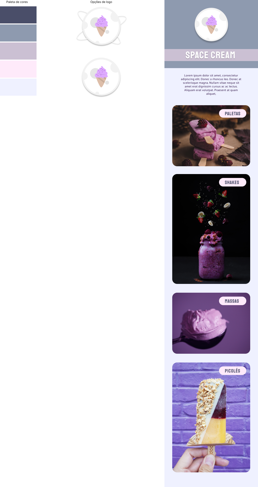

<h1 align="center"> Explorer - Stage 03 | Space Cream</h1>

Exclusive program, promoted by Rocketseat for teaching WEB technologies.

  <a href="#-technologies">Technologies</a>&nbsp;&nbsp;&nbsp;|&nbsp;&nbsp;&nbsp;
  <a href="#-project">Projects</a>&nbsp;&nbsp;&nbsp;|&nbsp;&nbsp;&nbsp;
  <a href="#memo-license">License</a>

  

 

  

## 🚀 Technologies

This project was developed with the following technologies:

- HTML
- CSS
- Git e Github
- Figma

## 💻 Project

This project was developed to learn the fundamentals of HTML and styling with CSS, presentation of responsiveness and mobile first technique.

## :memo: License

This project is licensed under the MIT license.

---

Made with ♥ by Rocketseat :wave: [Take part of your community!](https://discord.gg/rocketseat)
